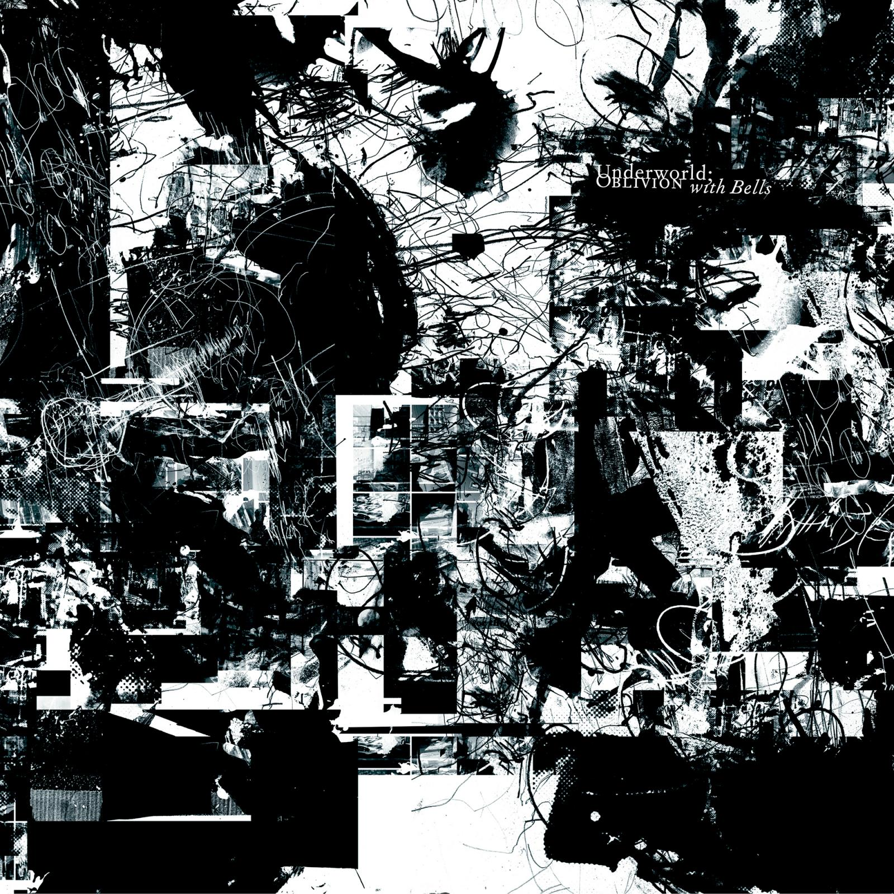
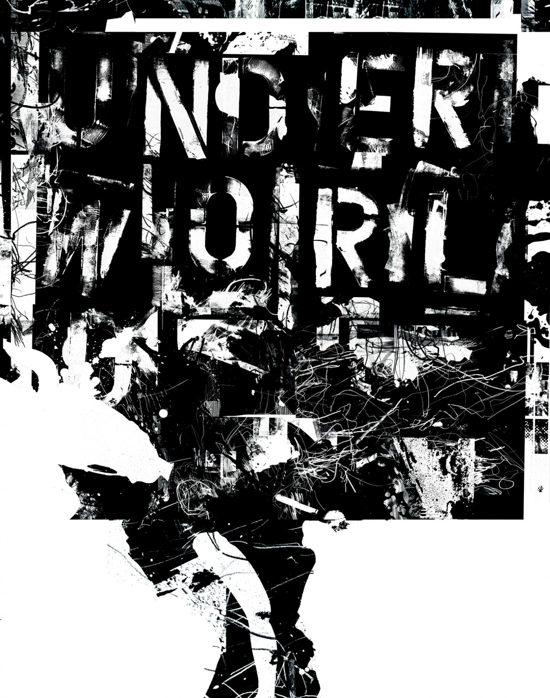
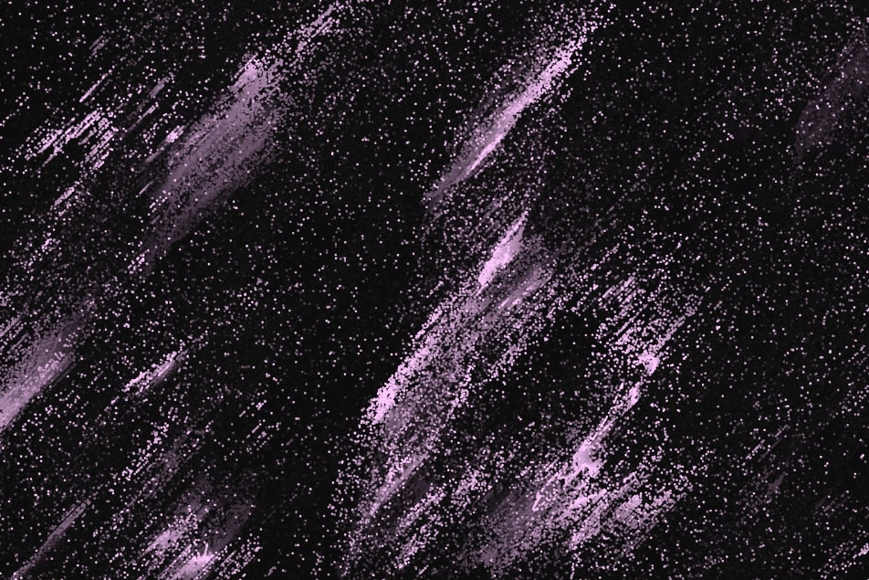
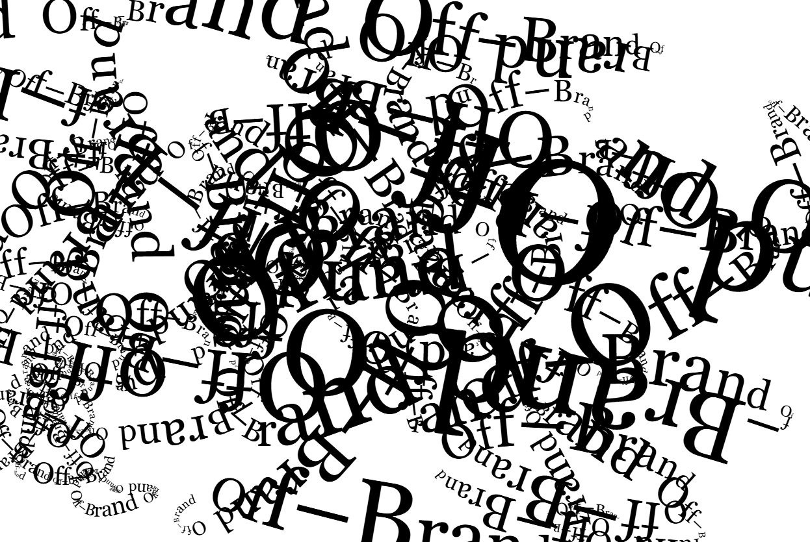

## Week8 Quiz - Major Project Inspiration
### Part 1: Imaging Technique Inspiration

[*underworld oblivion with bells* 2007](https://a-g-i.org/user/JohnWarwicker/view/projects/)

These two images are the source of my inspiration, and they are both from the artist John Warwicker. In *Underworld "Junkhead" Album cover* and *OWB Vinyl Album Front*, the combination of abstract layers, rough textures, and typography creates a very unique visual effect. Based on the compositional structure of the chosen artwork I want to incorporate a similar sense of random texture layering into my projects. And focus on the interacted texts to create a vibrant and dynamic effect, ideal for interactive digital art works. This technique meets the creative and visual complexity requirements of the project, making the design more visually appealing, while also providing ample space for experimentation with abstract shapes and color mixing effects.

### Part 2: Coding Technique Exploration

[*Cosmic Sands* xladn0 2024](https://p5js.org/sketches/2211359/)

I will be implementing abstract textures and dynamic text effects from John Warwicker's work using the p5.js library. The core idea is the Particle system, which creates organic, flowing textures through the particle class and the noise() function. I would customise the visual effects by adjusting particle counts, noise parameters, and movement algorithms. 

[*Text painter: from book Generative Design* Jerome 2024](https://openprocessing.org/sketch/2332297)

For text part, my idea is to draw text through mouse interaction, and combine font rotation and deformation effects to increase visual effects and achieve dynamic font drawing. Every time the mouse moves, the code adjusts the font size based on the distance of the mouse, and the text rotates across the canvas, creating an angular distortion of the text. Through repeated text drawing and interaction, a constantly changing and unique text track is formed on the screen increasing interest visually.